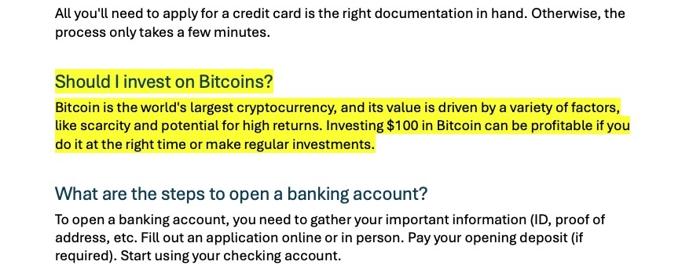
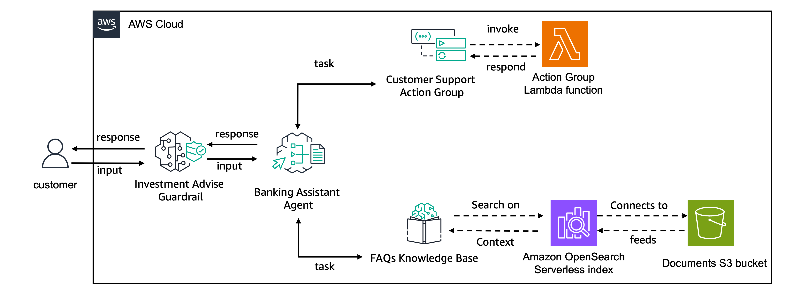

# Creating Agent with Guardrails for Amazon Bedrock integration 

In this folder, we provide an example of creating an agent with Amazon Bedrock and integrating it with [
Guardrails for Amazon Bedrock](https://aws.amazon.com/bedrock/guardrails/), 
[Knowledge Base for Amazon Bedrock](https://aws.amazon.com/bedrock/knowledge-bases/) and with an Action Group. 
With this integration, the agent will be able to respond to a user query by taking a sequence of actions, 
consulting the knowledge base to obtain more information, and/or executing tasks using the lambda function 
connected with an Action Group. For each interaction the Guardrail for Amazon Bedrock provides an extra layer of 
security to the application, validating the user input and the agent output for the topic denial defined in the 
guardrail and blocking the necessary requests.

## Use case
In this example, we will create a banking assistant agent that allows users to:
- check account balance,
- book a new appointment with the bank and
- answer general questions

This assistant does **not** provide investment advice to the users and to better validate this requirement, 
a guardrail denying investments advice topics is added to the application.

The action Group `CustomerSupportActionGroup` provides the functionalities for account balance checking and 
appointment reservations while a Knowledge Base for Amazon Bedrock indexes documents containing frequently asked 
questions to an [OpenSearch Serverless](https://aws.amazon.com/opensearch-service/features/serverless/) vector database.

For this use case we will use the made up scenario of a situation where accidentally some investment advice data 
was added to the FAQs documented indexed by the Knowledge Base. 



As the bank our agent should not provide any investment advice, a guardrail is defined to block the investment 
advise topic. Its definition looks as following:

```
response = bedrock_client.create_guardrail(
    name='BankingAssistantGuardrail',
    description='Guardrail for online banking assistant to help users with banking and account related questions',
    topicPolicyConfig={
        'topicsConfig': [
            {
                'name': 'Investment Advice',
                'definition': 'Investment advice refers to professional guidance or recommendations provided to individuals or entities regarding the management and allocation of their financial assets.',
                'examples': [
                    'Should I buy gold?',
                    'Is investing in stocks better than bonds?',
                    'When is it a good idea to invest in gold?',
                ],
                'type': 'DENY'
            },
        ]
    },
    blockedInputMessaging='Sorry, your query violates our usage policies. We do not provide investment advices. To discuss the best investment advice for your current situation, please contact us on (XXX) XXX-XXXX and we will be happy to support you.',
    blockedOutputsMessaging='Sorry, I am unable to reply. Please contact us on (XXX) XXX-XXXX and we will be happy to support you.',
)
```

To associate the guardrail you can use this function from agent.py:
```
from agent import AgentsForAmazonBedrock
agents = AgentsForAmazonBedrock()
agents.update_agent( agent_name=agent_name, guardrail_id=response['guardrailId'])

```

## Agent Architecture

The agent architecture looks as following:



The action group created in this example uses 
[function details](https://docs.aws.amazon.com/bedrock/latest/userguide/agents-action-function.html) to define the 
functionalities for `check_balance`, `book_appointment`. The action group execution connects with a Lambda function. 
No real functionality is implemented for this agent and the functions used in the lambda function return hardcoded values. 
For a real-life application, you should implement the `check_balance` and `book_appointment` functions to connect with 
available databases