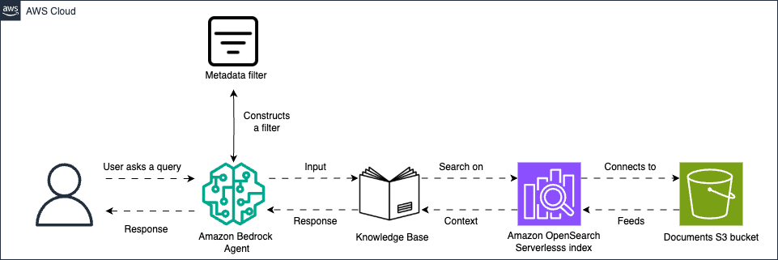

# Using metadata filtering with Amazon Bedrock Agents and Knowledge Bases

In this folder, we provide a set of examples on how to use metadata filtering with Amazon Bedrock Agents and Amazon Knowledge Base. This integration leverages metadata filtering to enhance the agent's information retrieval accuracy from the knowledge base, optimizing query responses."

## Use Case

In this example, we will create an agent that allows employees of `ExampleCompany` to ask questions about healthcare and finance benefits. The agebt uses metadata filters to ensure the correct information is retrieved for each employee.

We provide 3 different implementations of metadata filtering:

1. Explicit metadata filtering

2. Intelligent metadata filtering custom approach

3. Implicit metadata filtering

## Agent Architecture

**Method 1. Explicit metadata filtering**

The user provides a query and metadata filter to the Amazon Bedrock Agent.

**Method 2. Intelligent metadata filtering custom approach**

The user submits a natural language query to the workflow, which interfaces with the selected foundation model (FM) in Amazon Bedrock. The FM processes the query, extracting relevant keywords and semantic information to construct a structured metadata filter. This filter is then passed to the Amazon Bedrock Agent.

**Method 3. Implicit metadata filtering**

The user provides a query to the Amazon Bedrock agent and a metadata filter is created by Amazon Bedrock Knowledge Base at retrieval time.

## Authors
Yannie Wu @yanniewu

## License

This project is licensed under the Apache-2.0 License.
